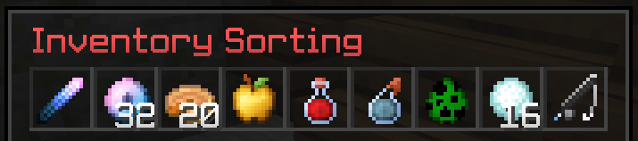
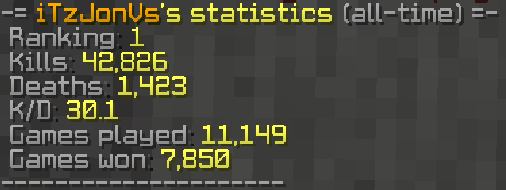

# Aura Classic Plugin
A minecraft plugin of the famous game mode **Aura Classic** made in pure [Kotlin](https://kotlinlang.org/) with the [Bukkit API](https://getbukkit.org/)

### Currently Supported Minecraft Versions
- Minecraft 1.8.8

### Features
- Fully customizable messages, countdowns and much more through a config file
- Statistics system with [MySQL](https://www.mysql.com/) (UUID based)
- Spectator mode and chat
- ... & basically every feature the game mode had on the [GommeHD.net](https://www.gommehd.net/) server

### Setup
- Drag the plugin jar file into your **plugins** folder
- Drag the **aura_world** folder into your server root folder
- Enter your MySQL server connection credentials in the **config.yml** file

### Permissions
Name | Description
--- | ---
`aura.start`| Allows the permission holder to utilize the start command
`aura.kick` | Allows the permission holder to kick a player out of the lobby phase and join himself
`aura.setspawn` | Allows the permission holder to utilize the setspawn command

### Commands
Usage | Description
--- | ---
`/start`| Skips the pre game countdown
`/setspawn` | Sets the spawn location for all players in the lobby
`/stats (<name>)` | Shows the players statistics

### Config
#### config.yml
Entry | Data Type | Description
--- | --- | ---
*min_players* | Int | Sets the **minimum** amount of players to start a game
*max_players* | Int | Sets the **maximum** amount of players (not spectators)
*hostname* | String | The hostname of the MySQL server
*port* | Int | The port of the MySQL server
*database* | String | The name of the database of the MySQL server
*username* | String | The username of the MySQL server user
*password* | String | The password of the MySQL server user
*waiting_delay* | Int | Sets the **delay** between **waiting for players** messages
*pre_game_countdown* | Int | Sets the countdown until the game starts
*protection_countdown* | Int | Sets the countdown until the protection phase ends
*ingame_countdown* | Int | Sets the countdown until the game ends
*tracker_countdown* | Int | Sets the countdown until the players get the **tracker** item
*post_game_countdown* | Int | Sets the countdown until the server restarts after the game
*inventory_sorting_name* | String | Sets the display name for the inventory sorting item
*tracker_name* | String | Sets the display name for the tracker item
*tablist_header* | String | Sets the header of the tablist
*tablist_footer* | String | Sets the footer of the tablist
*remaining_on_quit* | Boolean | Shows how many players are remaining after a player disconnected
> Each countdown value is measured in seconds

#### messages.yml
Entry | Data Type | Description | Variables
--- | --- | --- | ---
*join* | String | The message when a player joins the server | `{player}`
*quit* | String | The message when a player quits the server | `{player}`
*chat* | String | The message that is being displayed in the chat for everyone | `{player}`, `{message}`
*chat_spectator* | String | The message that is only being displayed in the spectator chat | `{player}`, `{message}`
*pre_game_timer* | String | The message when the pre game timer changes | `{time}`
*ingame_end_timer* | String | The message when the ingame end timer changes | `{time}`
*protection_timer* | String | The message when the protection phase timer changes | `{time}`
*post_game_timer* | String | The message when the post game timer changes | `{time}`
*waiting* | String | The **waiting for players** message | - 
*protection_start* | String | The message when the protection time begins | -
*protection_end* | String | The message when the protection time ends | -
*tracker_info* | String | The message when the players receive the **tracker** item | -
*ingame_end_info* | String | The message when the game is ending in **60 seconds** | -
*death* | String | The message when a player died | `{player}`
*kill* | String | The message when a player got killed | `{player}`, `{killer}`
*remaining* | String | The message that shows how many players are still alive | `{count}`
*win* | String | The message when a player has won the game | `{player}`
*stats_header* | String | The message for the stats command output header | `{player}`
*stats_ranking* | String | The message for the stats command output ranking | `{rank}`
*stats_kills* | String | The message for the stats command output kills | `{kills}`
*stats_deaths* | String | The message for the stats command output deaths | `{deaths}`
*stats_kd* | String | The message for the stats command output K/D | `{kd}`
*stats_played* | String | The message for the stats command output played games | `{played}`
*stats_won* | String | The message for the stats command output won games | `{won}`
*stats_footer* | String | The message for the stats command output footer | -

### Screenshots

### Contributing
When contributing to this repository, please first discuss the change you wish to make via issue, or any other method with the owner of this repository before making a change.

### Licence
This project is licensed under the MIT License - see the [LICENSE](/LICENSE) file for details